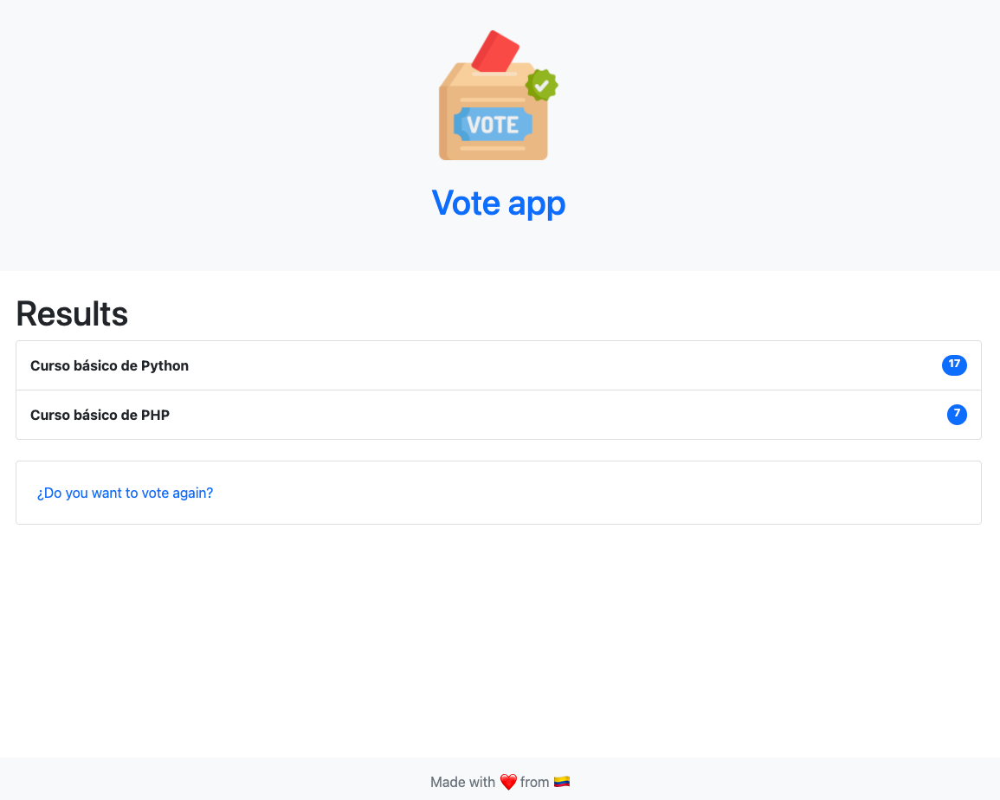

# vote-app 

[](https://github.com/cristian-rincon/vote-app/actions/workflows/django.yml)

[](https://www.buymeacoffee.com/cristianr)

Simple vote app built on top of Django. Currently the frontend layer are built on top of [Bootstrap](https://getbootstrap.com/).

## Instalation

This project currently uses [Poetry](https://python-poetry.org/) as dependency manager, you must install it before install left deps.

```bash
poetry install
```

## Usage

```bash
# Perform db migrations
poetry run python manage.py makemigrations
poetry run python manage.py migrate

# Creates a superuser (needed to use Django admin)
poetry run python manage.py createsuperuser

# Run local server
poetry run python manage.py runserver
```

## Look and feel

### Home view


### Vote view


### Results view



## Contributing

Pull requests are welcome. For major changes, please open an issue first to discuss what you would like to change.

Please make sure to update tests as appropriate.

## License

[MIT](https://choosealicense.com/licenses/mit/)

### Made with &#10084;&#65039; &nbsp;from &#127464;&#127476;
